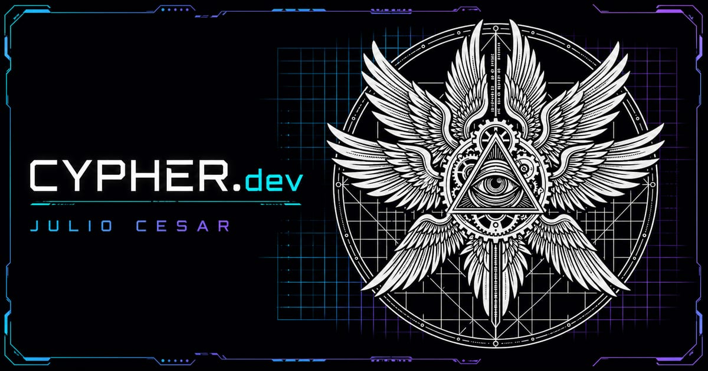
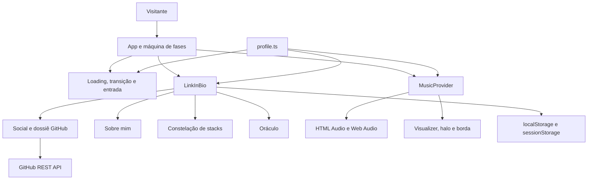

<div align="center">



# BioCypher

**Onde o sinal encontra o sigilo.**

Link in bio autoral de **Julio Cesar**, criado como uma experiência interativa que aproxima design visual, identidade, música e desenvolvimento frontend.

[](https://biocypher.tech/)
[](./CHANGELOG.md)
[](https://react.dev/)
[](https://www.typescriptlang.org/)
[](https://vercel.com/)
[](./LICENSE.md)

[Acessar o BioCypher](https://biocypher.tech/) · [GitHub](https://github.com/sCypher-me/BioCypher) · [GitLab](https://gitlab.com/sCypher-me/BioCypher) · [Apoiar o sinal](https://buymeacoffee.com/cypherdv)

</div>

---

## Sumário

- [Sobre o projeto](#sobre-o-projeto)
- [Recursos principais](#recursos-principais)
- [Experiência e controles](#experiência-e-controles)
- [Tecnologias](#tecnologias)
- [Arquitetura](#arquitetura)
- [Executando localmente](#executando-localmente)
- [Variáveis de ambiente](#variáveis-de-ambiente)
- [Scripts disponíveis](#scripts-disponíveis)
- [Personalização do conteúdo](#personalização-do-conteúdo)
- [Acessibilidade](#acessibilidade)
- [Desempenho](#desempenho)
- [Segurança e privacidade](#segurança-e-privacidade)
- [SEO e compartilhamento](#seo-e-compartilhamento)
- [Deploy na Vercel](#deploy-na-vercel)
- [Validação](#validação)
- [Versionamento e release](#versionamento-e-release)
- [Limitações conhecidas](#limitações-conhecidas)
- [Direitos autorais](#direitos-autorais)

## Sobre o projeto

O **BioCypher** é o repositório do perfil **CYPHER.dev**. Em vez de repetir o formato convencional de uma lista de links, o projeto apresenta o perfil como um console techno-gnostic: a entrada funciona como ritual, o card reage à música e cada seção revela uma camada diferente da identidade de Julio Cesar.

O produto foi desenvolvido com prioridade para mobile, mas assume uma composição própria em telas grandes. A partir de `1280px`, o card se transforma em um console dividido entre identidade e arquivo decodificado, sem duplicar o conteúdo ativo.

### Objetivos

- Apresentar identidade, trajetória e competências em uma experiência memorável.
- Manter navegação rápida e confortável em celulares.
- Combinar efeitos visuais com acessibilidade e controle de movimento.
- Operar como aplicação estática, sem backend, cookies ou analytics.
- Continuar funcional quando áudio, Web Audio ou GitHub API estiverem indisponíveis.

## Recursos principais

- **Ritual de entrada:** loading semântico, atalho `PULAR RITUAL` e tela inteira clicável.
- **Áudio integrado:** reprodução iniciada por gesto, volume de entrada em 40%, mute, volume persistente, seek e estados de erro.
- **Visualizer adaptativo:** barras embutidas no player, alimentadas por Web Audio e limitadas à paleta oficial.
- **Card responsivo:** composição compacta entre 320 e 420px e console expandido no desktop.
- **Dossiê GitHub:** perfil expansível com métricas públicas, linguagens, repositório em destaque, cache e fallback local.
- **Constelação de stacks:** competências organizadas como módulos orbitais interativos.
- **Oráculo:** terminal modal com comandos em inglês e aliases em português.
- **Portal aleatório:** o botão `SIGNAL` alterna entre Sobre, Stacks e GitHub sem repetir imediatamente o último destino.
- **Movimento controlável:** preferência manual persistida e suporte a `prefers-reduced-motion`.
- **Qualidade visual automática:** canvases ajustam DPR, densidade e frequência conforme viewport, hardware, conexão e visibilidade.
- **SEO completo:** canonical, Open Graph, Twitter Cards, JSON-LD, sitemap e robots.txt.

## Experiência e controles

### Fluxo principal

1. O loading apresenta o processo de decodificação.
2. Depois da transição, toda a tela de entrada aceita clique, toque, `Enter` ou `Espaço`.
3. O mesmo gesto abre o perfil e tenta iniciar a música.
4. O visitante navega entre `SOCIAIS`, `SOBRE MIM` e `STACKS` por clique, teclado ou swipe compatível.
5. Preferências relevantes permanecem disponíveis durante a sessão ou em visitas futuras.

### Atalhos e interações

| Ação | Controle |
|---|---|
| Abrir o oráculo | Tecla `/` ou botão `⌖` |
| Fechar o oráculo | `Escape`, botão de fechar ou área externa no desktop |
| Navegar pelas tabs | Clique, toque, `←`, `→`, `Home`, `End` ou swipe |
| Ativar easter egg | Digitar `sigil` fora de campos de texto |
| Pausar animações | Controle `Ⅱ` no header |
| Abrir destino aleatório | Botão `SIGNAL` no rodapé |
| Expandir GitHub | Cabeçalho do dossiê, `Enter` ou `Espaço` |

### Comandos do oráculo

| Comando | Alias em português | Resultado |
|---|---|---|
| `help` | `ajuda` | Lista os comandos disponíveis |
| `about` | `sobre` | Abre a apresentação |
| `links` | `canais` | Abre os canais sociais |
| `play` | `tocar` | Inicia a música |
| `pause` | `pausar` | Pausa a música |
| `transmit` | `share`, `compartilhar` | Compartilha a URL canônica |
| `sigil` | `sigilo` | Ativa o selo oculto |
| `whoami` | `quem-sou` | Retorna uma resposta do sistema |

## Tecnologias

| Camada | Tecnologia | Papel no projeto |
|---|---|---|
| Linguagem | TypeScript 5.9 | Tipagem estrita da interface e dos contratos de conteúdo |
| Interface | React 19 | Componentes, estado e ciclo de vida |
| Build | Vite 6 | Desenvolvimento local e bundle de produção |
| Estilos | Tailwind CSS 4 | Tokens, responsividade e composição visual |
| Movimento | Motion 11 | Transições, expansão, tabs e microinterações |
| Áudio | HTMLMediaElement + Web Audio API | Reprodução, análise de frequência e energia visual |
| Gráficos | Canvas 2D + SVG | Chuva binária, visualizer, grade e borda elétrica |
| Dados externos | GitHub REST API | Perfil e repositórios públicos sem token no cliente |
| Hospedagem | Vercel | CDN, HTTPS, headers e domínio próprio |

O projeto não utiliza banco de dados, servidor próprio, framework de autenticação ou dependências de analytics.

## Arquitetura



### Estrutura de diretórios

```text
BioCypher/
├── public/
│   ├── audio/                 # Faixa otimizada para streaming
│   ├── fonts/                 # Fontes locais em WOFF2
│   ├── *.avif / *.webp        # Logo e foto responsivas
│   ├── og-cypher.jpg          # Card social 1200 × 630
│   ├── robots.txt
│   └── sitemap.xml
├── src/
│   ├── components/            # Interface, player, canvases e painéis
│   ├── data/profile.ts        # Fonte única de conteúdo e configuração
│   ├── hooks/                 # Áudio, GitHub, movimento e qualidade visual
│   ├── utils/                 # Validação de URLs externas
│   ├── App.tsx                # Máquina de fases e composição global
│   ├── index.css              # Fontes, tokens e estilos globais
│   ├── main.tsx               # Entrada do React
│   └── tabTitle.ts            # Título animado após interação humana
├── .env.example
├── index.html                 # SEO, social cards e JSON-LD
├── vercel.json                # Headers, CSP e políticas de cache
├── vite.config.ts
├── tsconfig.json
└── package.json
```

### Responsabilidades principais

| Módulo | Responsabilidade |
|---|---|
| `App.tsx` | Controla `loading → transition → reveal → live` e o gesto de entrada |
| `MusicProvider.tsx` | Gerencia reprodução, status, mute, volume, AudioContext e energia |
| `LinkInBio.tsx` | Compõe identidade, tabs, portal, oráculo e layout responsivo |
| `MusicPlayer.tsx` | Exibe controles, timeline e visualizer integrado |
| `useAudioTimeline.ts` | Observa tempo e duração sem atualizar o provider em alta frequência |
| `useGithubProfile.ts` | Valida API, mescla respostas parciais e mantém fallback local |
| `useMotionPreference.ts` | Centraliza a preferência `system`, `enabled` ou `paused` |
| `useVisualQuality.ts` | Seleciona qualidade `high`, `balanced` ou `reduced` |
| `profile.ts` | Centraliza textos, mídia, links, stacks, comandos e labels acessíveis |
| `safeExternalUrl.ts` | Aceita somente URLs HTTPS e, quando necessário, hosts permitidos |

### Persistência no navegador

| Armazenamento | Dados |
|---|---|
| `localStorage` | Volume, mute e preferência manual de movimento |
| `sessionStorage` | Loading concluído, tab ativa e cache temporário do GitHub |

Nenhum desses dados identifica o visitante ou é enviado para serviços de rastreamento.

## Executando localmente

### Pré-requisitos

- [Node.js 24.x](https://nodejs.org/)
- npm 11.x, definido em `packageManager`
- Navegador moderno com suporte a ES2022, Canvas e Web Audio

### 1. Clone o repositório

```bash
git clone https://github.com/sCypher-me/BioCypher.git
cd BioCypher
```

O espelho também estará disponível no GitLab:

```bash
git clone https://gitlab.com/sCypher-me/BioCypher.git
cd BioCypher
```

### 2. Instale as dependências

Use `npm ci` para reproduzir exatamente o `package-lock.json`:

```bash
npm ci
```

### 3. Configure o ambiente

macOS ou Linux:

```bash
cp .env.example .env.local
```

Windows PowerShell:

```powershell
Copy-Item .env.example .env.local
```

### 4. Inicie o servidor

```bash
npm run dev
```

Acesse [http://localhost:5173](http://localhost:5173). Se a porta estiver ocupada, o Vite selecionará a próxima disponível.

### 5. Gere e visualize a produção

```bash
npm run build
npm run preview
```

O bundle será criado em `dist/`, diretório que não deve ser versionado.

## Variáveis de ambiente

| Variável | Obrigatória | Descrição | Exemplo |
|---|:---:|---|---|
| `VITE_SITE_URL` | Produção | URL canônica usada pelo compartilhamento | `https://biocypher.tech` |

Não há tokens, chaves privadas ou credenciais da API do GitHub no frontend. Variáveis iniciadas por `VITE_` são incorporadas ao bundle e nunca devem armazenar segredos.

## Scripts disponíveis

| Comando | Descrição |
|---|---|
| `npm run dev` | Inicia o Vite em modo de desenvolvimento |
| `npm run typecheck` | Executa TypeScript estrito sem emitir arquivos |
| `npm run build` | Executa typecheck e gera o bundle Vite |
| `npm run check` | Validação completa atualmente equivalente ao build |
| `npm run preview` | Serve localmente o conteúdo de `dist/` |

## Personalização do conteúdo

O arquivo [src/data/profile.ts](./src/data/profile.ts) é a fonte única de conteúdo. Componentes devem controlar apresentação e interação, não textos ou destinos.

| Área | Propriedade principal |
|---|---|
| Identidade | `profile.name`, `handle`, `location`, `declaration`, `bio` |
| Sinal atual | `profile.currentSignal` |
| Música | `profile.audio` |
| GitHub | `profile.github` |
| Plataformas | `profile.platforms` |
| Apoio | `profile.support` |
| Sobre | `profile.about` |
| Competências | `profile.stacks` |
| Oráculo | `profile.oracle` |
| Imagens | `profile.media` |

### Ativando uma plataforma social

Os dez canais aparecem bloqueados enquanto `href` for `null`. Para ativar um deles, adicione uma URL HTTPS válida:

```ts
{ id: "linkedin", label: "LinkedIn", href: "https://www.linkedin.com/in/seu-perfil" }
```

### Substituindo mídia

- Preserve dimensões e variantes AVIF/WebP da logo e da foto.
- Atualize os caminhos explicitamente em `profile.media`; não derive nomes com substituições de string.
- Mantenha a imagem Open Graph em `1200 × 630`.
- Utilize áudio próprio ou devidamente autorizado e mantenha `preload="metadata"`.
- Não inclua materiais-fonte pesados em `public/`.

## Acessibilidade

- Tabs seguem o padrão ARIA com `tablist`, `tab`, `tabpanel` e navegação por setas.
- O oráculo utiliza `role="dialog"`, `aria-modal`, foco contido, fechamento por `Escape` e retorno ao acionador.
- Loading expõe progresso semântico e permite pular a animação por teclado.
- Controles essenciais possuem área mínima aproximada de `44 × 44px`.
- Links externos comunicam abertura em nova aba nos nomes acessíveis.
- Status do player, compartilhamento e movimento usam regiões vivas quando necessário.
- `prefers-reduced-motion` e a preferência manual interrompem movimentos não essenciais.
- A interface mantém foco visível e navegação completa por teclado.

## Desempenho

- Logo e foto são servidas em AVIF/WebP com `srcSet` e fallback explícito.
- Somente cinco fontes WOFF2 são carregadas localmente.
- A faixa é transmitida em aproximadamente 128 kbps com preload de metadados.
- Canvases pausam quando a página está oculta ou fora da viewport.
- DPR e frequência dos efeitos são limitados conforme a qualidade visual calculada.
- A API GitHub usa `AbortController`, validação de resposta e cache por sessão.
- A aplicação não carrega GSAP, Three.js, bibliotecas de ícones ou analytics.

Budgets adotados para a V1.0:

| Recurso | Limite |
|---|---:|
| JavaScript | 135 KB gzip |
| CSS | 15 KB gzip |
| Fontes WOFF2 | 40 KB no total |
| Áudio | 4,2 MB |

## Segurança e privacidade

O BioCypher é uma aplicação estática. As principais proteções são configuradas em [vercel.json](./vercel.json):

- Content Security Policy com fontes, mídia, imagens e conexões explicitamente limitadas.
- `frame-ancestors 'none'` e `X-Frame-Options: DENY` contra incorporação em iframe.
- `object-src 'none'`, `base-uri 'self'` e `form-action 'self'`.
- HSTS, bloqueio de MIME sniffing, política de referrer e Permissions Policy.
- URLs externas restritas a HTTPS e abertas com `noopener,noreferrer`.
- Respostas do GitHub validadas antes de renderização ou cache.
- Nenhum token da API, cookie, pixel ou identificador de analytics.

A proteção de cópia, seleção e menu de contexto é apenas uma barreira de interface. Ela não funciona como DRM e não substitui a proteção jurídica ou o controle de acesso do servidor.

## SEO e compartilhamento

- Domínio canônico: [https://biocypher.tech/](https://biocypher.tech/)
- `www.biocypher.tech` configurado para redirecionar permanentemente ao domínio principal.
- Metadados em Português do Brasil.
- Open Graph para WhatsApp, Telegram, LinkedIn e Instagram.
- Twitter Card para compartilhamento no X.
- JSON-LD com `WebSite`, `ProfilePage` e `Person`.
- Imagem social dedicada em JPEG, `1200 × 630`.
- `robots.txt` e `sitemap.xml` públicos.
- Título SEO preservado até a primeira interação humana; depois disso, o efeito autoral da aba pode ser ativado.

## Deploy na Vercel

O projeto é estático e já possui configuração compatível com a Vercel.

### Configuração esperada

| Campo | Valor |
|---|---|
| Framework | Vite |
| Node.js | 24.x |
| Install Command | `npm ci` |
| Build Command | `npm run build` |
| Output Directory | `dist` |
| Variável de produção | `VITE_SITE_URL=https://biocypher.tech` |

### Fluxo recomendado

1. Importe `sCypher-me/BioCypher` na Vercel.
2. Confirme a variável `VITE_SITE_URL` no ambiente Production.
3. Mantenha `biocypher.tech` como domínio principal.
4. Mantenha `www.biocypher.tech` como redirecionamento `308`.
5. Faça o primeiro deploy somente após `npm run check` ser aprovado.
6. Valide CSP, headers, HTTPS, sitemap e cards sociais no ambiente público.

Arquivos pessoais, backups, ZIPs, fontes-fonte, ambientes locais e a pasta `.vercel/` são excluídos do versionamento e do upload.

## Validação

### Verificação automatizada disponível

```bash
npm run check
```

Esse comando executa TypeScript estrito e o build de produção. A V1.0 não possui suíte de testes unitários ou end-to-end automatizada; portanto, a validação funcional também inclui inspeção manual.

### Checklist manual essencial

- Loading normal, movimento reduzido e `PULAR RITUAL`.
- Entrada por clique, toque, `Enter` e `Espaço`.
- Áudio permitido, bloqueado, pausado, mudo e indisponível.
- Seek, duração e persistência de volume.
- Tabs por mouse, toque, teclado e swipe.
- Oráculo, foco contido, aliases e fechamento por `Escape`.
- GitHub ao vivo, cache, dados parciais, offline e fallback.
- Movimento manual, aba em segundo plano e canvases fora da viewport.
- Layouts em 320, 360, 390, 420, 768, 1024, 1280 e 1440px.
- Ausência de overflow horizontal e controles comprimidos.

## Versionamento e release

O projeto segue [Versionamento Semântico](https://semver.org/lang/pt-BR/):

- `MAJOR`: mudanças incompatíveis ou nova geração da experiência.
- `MINOR`: recursos compatíveis adicionados.
- `PATCH`: correções compatíveis.

Convenção de commits:

```text
feat: nova funcionalidade
fix: correção de comportamento
refactor: mudança interna sem alterar comportamento
docs: documentação
test: testes
chore: configuração, dependências ou manutenção
```

A release inicial utiliza a tag anotada `v1.0.0`. Mudanças relevantes são registradas em [CHANGELOG.md](./CHANGELOG.md).

## Limitações conhecidas

- Navegadores exigem gesto do usuário para iniciar áudio; a tela de entrada fornece esse gesto, mas a reprodução ainda pode ser bloqueada por políticas locais.
- A GitHub REST API pública possui rate limit. O dossiê permanece utilizável com cache e snapshot local.
- Canais sociais sem URL configurada permanecem visíveis e bloqueados intencionalmente.
- O conteúdo principal depende de JavaScript, embora metadados SEO e dados estruturados existam no HTML inicial.
- A V1.0 não inclui backend, painel administrativo, analytics, cookies ou testes automatizados.

## Direitos autorais

Copyright © 2026 Julio Cesar. **Todos os direitos reservados.**

Este repositório é público para apresentação e consulta, mas não é open source. Nenhuma permissão de cópia, modificação, distribuição, comercialização ou reutilização é concedida sem autorização prévia e expressa. Consulte [LICENSE.md](./LICENSE.md).

Bibliotecas e materiais de terceiros permanecem sujeitos às licenças e autorizações de seus respectivos titulares.

---

<div align="center">

Desenhado e desenvolvido por **Julio Cesar** · Goiânia — GO

**CYPHER.dev // SIGNAL ONLINE**

</div>
